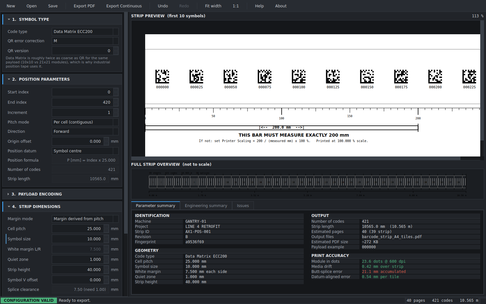

# AOPS — Absolute Optical Position Strip Generator

An offline engineering utility that generates **industrial optical positioning strips** for
PLC-controlled machinery: long printed strips of Data Matrix codes at a fixed pitch, mounted along
a machine axis. A fixed-mount reader scans a symbol and the PLC derives absolute position from it.

This is commissioning tooling in the class of SICK / Keyence / Cognex / Leuze / Pepperl+Fuchs —
**not** a barcode label generator. That distinction drives the whole design: splice safety, print
calibration, scanner optics and traceability are first-class features rather than decoration.



---

## Quick start

Python 3.12 or later is the only prerequisite.

**Windows** — double-click **`run.bat`**.

**Linux / macOS** — `./run.sh`

The first run creates `.venv`, installs the dependencies into it, and launches the GUI.
Every run after that starts immediately. The same launchers forward arguments for headless
use:

```
run.bat info                 (Windows)
./run.sh export -o ./out     (Linux / macOS)
```

If you already have an environment set up, `python run.py` does the same thing without the
venv bootstrap.

> **Do not run `python src/aops/app.py` directly.** The package uses a `src` layout, so
> running a file inside it puts `src/aops/` on `sys.path` rather than `src/`, and the import
> fails with `ModuleNotFoundError: No module named 'aops'`. `run.py` exists precisely to
> make that mistake impossible — it puts `src/` on the path first.

### Manual install

If you would rather manage the environment yourself:

```bash
# Native libdmtx (pylibdmtx is a ctypes binding and needs the shared library).
# Note: libdmtx0b has no install candidate on Ubuntu Noble; the runtime .so
# ships with the -dev package. On Windows the pylibdmtx wheel bundles the DLL,
# so this step is not needed there.
sudo apt-get update && sudo apt-get install -y libdmtx-dev

# Qt runtime, on a minimal or headless Linux host
sudo apt-get install -y libegl1 libxkbcommon-x11-0 libxcb-cursor0 \
    libxcb-icccm4 libxcb-keysyms1 libxcb-shape0 libxcb-render-util0

python3.12 -m venv .venv
./.venv/bin/pip install -r requirements.txt
```

### pylibdmtx on Python 3.12+

pylibdmtx 0.1.10 imports `distutils.version.LooseVersion`, and `distutils` was removed from the
standard library in Python 3.12 (PEP 632), so importing it fails outright. AOPS installs a minimal
shim into `sys.modules` before pylibdmtx loads — see `src/aops/symbols/compat.py`. No setuptools
dependency is needed, and the shim never clobbers a real `distutils`.

## Run

Via the launcher (no activation needed):

```bash
./run.sh                       # GUI
./run.sh info                  # summarise a configuration
./run.sh export -o ./out       # export PDFs, no GUI required
./run.sh symbol 010500         # print one symbol as ASCII
```

Or directly against the virtual environment:

```bash
./.venv/bin/python -m aops                       # GUI
./.venv/bin/python -m aops.cli info              # summarise a configuration
./.venv/bin/python -m aops.cli export -o ./out   # export PDFs, no GUI required
./.venv/bin/python -m aops.cli symbol 010500     # print one symbol as ASCII
```

## Test

```bash
QT_QPA_PLATFORM=offscreen ./.venv/bin/python -m pytest
./.venv/bin/ruff check src tests
```

The whole suite runs headlessly, including the GUI smoke tests.

---

## What the tool actually decides for you

### The field of view is set by the pitch, not the symbol size

The single most important number AOPS produces, and it is not obvious. Codes of width `S` repeat
with period `P`. A camera window of width `W` fully contains a given code over an interval of
length `W − S`, repeating every `P`. For **N** complete codes to be in view at *every* axis
position those intervals must overlap N deep, which requires:

```
W_min = N × P + S
```

At the default 25 mm pitch and 10 mm symbol that is **35 mm for N = 1** — not the ~12 mm an
engineer might infer from the symbol size. Below `W_min` there are **blind zones where no complete
code is visible and the machine loses absolute position**.

Real industrial readers (e.g. Pepperl+Fuchs PXV) read three codes at once so the tape can be damaged
without losing position. At N = 3 the requirement rises to 85 mm and buys `(N−1) × P` = 50 mm of
survivable occlusion. Both figures appear in the Engineering summary and on the installation guide.

### Butt-splicing accumulates error; datum alignment does not

If tiles are butt-spliced end to end, a systematic printer scale error compounds **linearly**: at
0.2 % over 10.5 m that is **21 mm**, fatal for a sub-millimetre positioning system. If each tile is
instead positioned against a measured datum, the error is bounded by one tile — about **0.6 mm**.

So every sheet prints the absolute X range of its own leading edge, and the guide instructs
alignment with a steel tape rather than by abutting. Both figures are shown side by side in the
Parameter summary so the reason is self-evident.

### The substrate outranks every software setting

| Medium | Change, 20 → 80 %RH | Over a 10.5 m strip |
|---|---|---|
| Paper | ~3 % | **~315 mm** — unusable |
| Coated film | ~0.5 % | ~52 mm |
| Polyester film | ~0.006 % | ~0.6 mm |

Paper is a hard validation error for any strip over a metre (`MED-001`), quoting the predicted drift
in millimetres.

### …but on the substrate you actually use, temperature beats humidity

Once paper is ruled out, humidity stops being the dominant term and almost everyone keeps optimising
it anyway. Polyester moves 0.004 % over a 40-point humidity swing and 0.051 % over a 30 °C one —
**twelve times more**. Over the default 10.565 m strip:

| Term | Movement | Modelled by |
|---|---|---|
| Humidity, 40 %RH | 0.42 mm | `media_drift_mm` |
| Datum-aligned print error | 0.54 mm | `bounded_error_mm` |
| **Thermal, 30 °C, polyester on steel** | **1.58 mm** | `thermal_drift_mm` |
| Thermal, same strip referenced to granite | 3.49 mm | `thermal_differential_mm` |

Two things make this more than a bigger number.

**Only the difference against the frame reaches the reading.** Polyester (17 ppm/°C) on steel
(12 ppm/°C) leaves 5 ppm; on aluminium (23 ppm/°C) it leaves −6 ppm and **the error changes sign**.
Compensating in the wrong direction doubles it, so `thermal_differential_mm` is reported signed.

**The mounting decides whether it reaches the reading at all.** A continuously bonded strip is
dragged along by the frame, so a code stays over the feature it was aligned to and the term very
largely cancels — against features on *that same frame*. The strain does not vanish; the adhesive
carries it, which is reported as `bond_strain_ppm` and warned about at `MED-008`. An end-anchored
strip expands freely and takes the whole differential (`MED-006`).

So the answer to "how accurate is my strip" depends on a question the tool previously never asked:
what is it stuck to, and how.

### Splice safety is proved, not hoped for

Page boundaries only ever fall in the white gap between symbols. The packer treats a cell as
**atomic**: only pure-white segments are ever divisible.

> If `symbol + 2 × quiet_zone ≤ pitch`, every page boundary is either inside a white segment (no ink
> at all) or at a cell junction, where the clearance on both sides is
> `margin_lr = (pitch − symbol) / 2 ≥ quiet_zone`.

At the default geometry that is **7.5 mm of clearance against a 1.0 mm requirement** — a 7.5×
margin on cutting accuracy. `verify_splices()` re-derives the property *independently* from the
placed geometry, and runs both in the test suite and again at export time, so a packer bug cannot
silently ship a strip with a symbol cut in half.

### Symbols are vector, and verified

The Data Matrix encoder returns a bitmap, so AOPS recovers the **module matrix** from it and draws
vector rectangles at exact millimetre positions — infinitely sharp at any RIP resolution, where an
embedded raster would be resampled. The recovered matrix is fed back through a real Data Matrix
decoder before the file is written (`VerifyMode.SAMPLE` checks sixteen codes in about half a
second), which turns "the PDF is probably right" into evidence.

### Continuous export beyond the PDF page limit

PDF caps a page at 14400 pt (5080 mm). A 10.565 m strip is 2.08× over. Three strategies, selectable:

| Strategy | Behaviour |
|---|---|
| `USER_UNIT` (default) | One true-size page via `/UserUnit` (PDF 1.6+). Honoured by Acrobat 7+ and modern RIPs. |
| `RAW_OVERSIZE` | Emits the real oversized MediaBox. Many large-format RIPs accept it; Acrobat refuses. |
| `SPLIT_ROLL` | N conformant files. Universally safe, must be spliced. |

ReportLab has no `/UserUnit` support, and the obvious implementation silently fails —
`PDFCatalog.__init__` pre-seeds every `__NoDefault__` key to `None` on the instance, shadowing any
class attribute. The value has to be set on the instance at format time; see
`src/aops/render/pdf/userunit.py`.

---

## Architecture

Dependencies point inward only, and this is **enforced by a test** (`tests/test_layering.py`,
which walks every module's AST):

```
ui ──▶ controller ──▶ render ──▶ symbols ──▶ core
core imports no PySide6, reportlab, qrcode, pylibdmtx or PIL
```

```
src/aops/
├── core/              PURE DOMAIN — no third-party imports at all
│   ├── units.py       mm↔pt↔µm; authored dims round(), capacities floor()
│   ├── config.py      frozen dataclasses; every float carries a unit suffix
│   ├── cell.py        CellSpec + the invariants splice safety rests on
│   ├── geometry.py    segments, paginate(), verify_splices()      ← highest risk
│   ├── positions.py   index → position, and the PLC formula string
│   ├── payload.py     absolute-millimetre payload construction
│   ├── scanner.py     field-of-view and working-distance model
│   ├── media.py       substrate drift, cumulative vs bounded splice error
│   ├── rules.py       ~50 validation rules across 10 prefixes
│   ├── drawlist.py    Painter protocol — the one layout abstraction
│   └── layout/        style, bands, elements, strip, guide, preview, overview
├── symbols/           may import qrcode/pylibdmtx/PIL; never Qt or ReportLab
├── render/pdf/        ReportLab backend, /UserUnit, exporters
├── render/qt/         QPainter backend, raster tier of the symbol cache
├── controller/        ConfigStore (undo/redo), AppController, ExportWorker
└── ui/                the only package importing PySide6 widgets
```

**Layout is written exactly once.** Both the on-screen preview and the exported PDF consume the same
`DrawList`, so they cannot drift apart. Adding SVG, PNG or DXF output means implementing `Painter`
and nothing else.

### Why integer micrometres

All packing arithmetic is `int` µm. Pagination asks "does one more 25.000 mm cell fit in
275.0000000001 mm?" thousands of times, and in binary floating point that question has no stable
answer. In integer micrometres it is decidable — which is what lets the splice property be *proved*
rather than approximated. Floats appear only at the emit boundary.

### Performance

| Work | Cost | When |
|---|---|---|
| Validation + pagination | ~200 µs @ 421 codes | every change, synchronous |
| Preview (first 10 symbols) | ~3 ms cold, ~0 cached | every change, synchronous |
| Overview (**zero encodes**) | ~0.7 ms | on repagination only |
| Export (421 symbols, vector) | ~0.4 s, ~130 KB | worker thread |

Everything on the interactive path is bounded by a constant independent of code count. Symbol cache
keys exclude all geometry, so zooming 100 % → 400 % re-encodes nothing.

---

## Extension points

Deliberately architected but **not implemented** in this build:

- **New output formats** — implement `core.drawlist.Painter`; layout code is untouched.
- **New symbologies** — one encoder module plus one line in `symbols/registry.py`. Code 128,
  Code 39 and Aztec are registered as `UnavailableEncoder`, which refuses at three independent
  layers rather than silently substituting another symbology.
- **Dual track, camera fiducials, CRC blocks** — register as non-splittable `Segment`s and inherit
  the splice guarantee from the packer with no changes to it.
- **Reverse numbering** — already implemented via `Direction.REVERSE`.

## Domain references

- [Pepperl+Fuchs PCV / PXV Data Matrix positioning](https://www.pepperl-fuchs.com/en/products/industrial-sensors/positioning-systems/camera-based-linear-positioning-pcv-pxv-gp31908)
- [Leuze barcode positioning systems (BPS)](https://www.leuze.com/en-int/products/measuring-sensors/sensors-for-positioning/bar-code-positioning-systems)
- [ISO/IEC 15415 — 2D print-quality grading](https://www.iso.org/standard/86390.html) (target grade A or B)
- [ISO/IEC 16022 — Data Matrix](https://www.iso.org/standard/44230.html)
